# Offer信息站 V1 数据 ER 图

```mermaid
erDiagram

    %% ─────────────────────────────────────────
    %% 用户体系
    %% ─────────────────────────────────────────

    用户 {
        bigint   用户ID      PK
        string   微信openid  UK "微信唯一标识"
        string   昵称
        string   头像URL
        string   角色        "user / admin"
        string   utm来源     "注册时记录，如 xiaohongshu"
        string   utm活动     "如 春招攻略帖"
        string   utm内容     "帖子ID等"
        datetime 注册时间
    }

    %% ─────────────────────────────────────────
    %% 会员 & 支付
    %% ─────────────────────────────────────────

    订单 {
        bigint   订单ID       PK
        string   订单号       UK
        bigint   用户ID       FK
        string   商品类型     "membership / doc"
        bigint   商品ID       "会员SKU-ID 或 资料ID"
        bigint   用户优惠券ID FK "可为空"
        decimal  原价
        decimal  实付金额
        string   支付渠道     "wechat / alipay"
        string   订单状态     "待支付/已支付/已退款/已关闭"
        datetime 创建时间
        datetime 支付时间
    }

    支付流水 {
        bigint   流水ID        PK
        bigint   订单ID        FK
        string   第三方交易号  UK "微信/支付宝流水号"
        string   支付渠道
        decimal  金额
        string   回调状态      "待回调/成功/失败"
        datetime 支付时间
    }

    会员权益 {
        bigint   权益ID   PK
        bigint   用户ID   FK
        bigint   订单ID   FK
        string   会员类型 "campus（校招）/ civil（事业编）"
        datetime 开始时间
        datetime 到期时间
        string   状态     "有效/已过期"
    }

    优惠券模板 {
        bigint   模板ID       PK
        string   优惠码       UK
        string   类型         "固定减 / 折扣"
        decimal  面值
        decimal  折扣率       "折扣类型时使用，如0.75=75折"
        string   适用商品类型 "membership / doc / all"
        int      使用上限     "0表示不限"
        int      已使用次数
        datetime 有效期至
        datetime 创建时间
    }

    用户优惠券 {
        bigint   用户券ID   PK
        bigint   用户ID     FK
        bigint   模板ID     FK
        bigint   使用订单ID FK "使用时关联的订单，可为空"
        string   状态       "未使用 / 已使用 / 已过期"
        string   获取来源   "活动发放 / 手动发放"
        datetime 获取时间
        datetime 使用时间
    }

    %% ─────────────────────────────────────────
    %% 内容数据：校招岗位
    %% ─────────────────────────────────────────

    校招岗位 {
        bigint   岗位ID       PK
        string   来源唯一键   UK "source_key，防重复同步"
        string   来源标签     "飞书同步 / 人工增加"
        string   企业名称
        string   企业类型     "国企/民企/合资/外企/事业单位/公益性"
        string   招聘类型     "动态标签：26届春招/26届秋招/暑期实习/日常实习"
        string   工作城市
        string   招聘岗位
        string   所属行业     "金融业/IT互联网/房地产建筑/耐用消费品/..."
        string   信息来源     "文本，如企业公众号名称"
        date     网申开始日期
        date     网申截止日期
        string   毕业生要求   "如 国内:博士及以上/26届；留学生:博士及以上/26届"
        string   投递链接     "加密存储，仅校招会员可获取"
        string   原文链接     "加密存储，仅校招会员可获取"
        string   发布状态     "PUBLISHED / UNPUBLISHED"
        string   生命周期     "ACTIVE / EXPIRED / DELETED"
        boolean  手动锁定     "true时飞书同步不得覆盖或恢复发布"
        datetime 创建时间
        datetime 更新时间
    }

    %% ─────────────────────────────────────────
    %% 内容数据：事业编/国企岗位
    %% ─────────────────────────────────────────

    事业编岗位 {
        bigint   岗位ID       PK
        string   来源唯一键   UK "source_key，防重复同步"
        string   来源标签     "飞书同步 / 人工增加"
        string   公告标题
        string   省份
        string   区域         "市/区"
        string   类型         "事业单位/国企/银行/教师编/其他"
        text     公告详情     "长文本，公告正文内容"
        date     报名开始日期
        date     报名截止日期
        int      招聘人数
        int      职位数量
        string   报考学历要求 "如 本科及以上"
        string   报考年龄要求 "如 18-35周岁"
        string   具体岗位     "岗位名称，多个用逗号分隔"
        string   原文链接     "加密存储，仅事业编会员可获取"
        string   发布状态     "PUBLISHED / UNPUBLISHED"
        string   生命周期     "ACTIVE / EXPIRED / DELETED"
        boolean  手动锁定     "true时飞书同步不得覆盖或恢复发布"
        datetime 创建时间
        datetime 更新时间
    }

    %% ─────────────────────────────────────────
    %% 内容数据：面试资料
    %% ─────────────────────────────────────────

    面试资料 {
        bigint   资料ID      PK
        string   标题
        string   简介
        string   行业
        string   企业标签    "如 腾讯,字节"
        decimal  价格
        int      预览页数    "默认3页"
        string   文件存储Key "OSS/S3 key"
        int      销量
        string   状态        "DRAFT / PUBLISHED / UNPUBLISHED"
        datetime 创建时间
        datetime 更新时间
    }

    用户资料权限 {
        bigint   权限ID   PK
        bigint   用户ID   FK
        bigint   资料ID   FK
        bigint   订单ID   FK
        datetime 解锁时间
    }

    %% ─────────────────────────────────────────
    %% 数据同步：飞书同步配置 & 任务
    %% ─────────────────────────────────────────

    飞书同步配置 {
        bigint   配置ID       PK
        string   数据类型     "campus / civil"
        string   飞书AppToken
        string   飞书表格ID
        string   飞书视图ID
        json     字段映射配置 "飞书列名→系统字段的映射JSON"
        int      同步间隔分钟 "默认60分钟"
        boolean  自动同步开关
        datetime 上次同步时间
        datetime 创建时间
    }

    数据同步任务 {
        bigint   任务ID       PK
        bigint   配置ID       FK
        string   数据类型     "campus / civil"
        string   触发方式     "auto（定时）/ manual（手动）"
        string   任务状态     "处理中 / 完成 / 失败"
        int      新增数量
        int      更新数量
        int      跳过数量
        int      失败数量
        string   失败原因     "简要描述"
        bigint   操作员用户ID FK "手动触发时记录"
        datetime 开始时间
        datetime 完成时间
    }

    %% ─────────────────────────────────────────
    %% 用户行为：投递 & 简历 & 收藏 & 分组
    %% ─────────────────────────────────────────

    投递记录 {
        bigint   记录ID       PK
        bigint   用户ID       FK
        string   来源类型     "campus / civil / manual"
        bigint   校招岗位ID   FK "来源campus时关联，可为空"
        bigint   事业编岗位ID FK "来源civil时关联，可为空"
        string   企业名称     "manual时手动填写"
        string   岗位名称     "manual时手动填写"
        string   投递阶段     "已收藏/已投递/笔试/一面/二面/终面/OC/已拒/已放弃"
        bigint   关联简历ID   FK "可为空"
        bigint   所属分组ID   FK "可为空"
        string   备注
        datetime 投递时间
        datetime 更新时间
    }

    阶段变更日志 {
        bigint   日志ID     PK
        bigint   投递记录ID FK
        string   变更前阶段
        string   变更后阶段
        string   备注
        datetime 变更时间
    }

    简历 {
        bigint   简历ID    PK
        bigint   用户ID    FK
        string   简历名称  "如 互联网-产品岗"
        string   文件存储Key
        string   文件格式  "pdf / docx"
        string   标签
        string   备注
        datetime 上传时间
    }

    用户分组 {
        bigint   分组ID   PK
        bigint   用户ID   FK
        string   分组名称 "如 冲刺/保底/备选"
        int      排序权重
        datetime 创建时间
    }

    收藏记录 {
        bigint   收藏ID   PK
        bigint   用户ID   FK
        string   内容类型 "campus / civil / doc"
        bigint   内容ID   "对应各内容表的主键"
        datetime 收藏时间
    }

    %% ─────────────────────────────────────────
    %% 后台运营：反馈
    %% ─────────────────────────────────────────

    用户反馈 {
        bigint   反馈ID   PK
        bigint   用户ID   FK
        string   内容类型 "campus / civil / doc"
        bigint   内容ID
        string   反馈类型 "链接失效 / 内容错误 / 其他"
        string   处理状态 "待处理 / 处理中 / 已完成"
        string   描述
        datetime 创建时间
    }

    %% ═════════════════════════════════════════
    %% 关系定义
    %% ═════════════════════════════════════════

    %% 用户 → 基础关联
    用户              ||--o{  订单             : "下单"
    用户              ||--o{  会员权益         : "持有"
    用户              ||--o{  用户优惠券       : "持有"
    用户              ||--o{  投递记录         : "管理"
    用户              ||--o{  简历             : "上传"
    用户              ||--o{  用户分组         : "创建"
    用户              ||--o{  收藏记录         : "收藏"
    用户              ||--o{  用户资料权限     : "购买解锁"
    用户              ||--o{  用户反馈         : "提交"

    %% 订单 → 支付 & 权益
    订单              ||--o{  支付流水         : "产生流水"
    订单              |o--o|  会员权益         : "开通会员"
    订单              |o--o|  用户资料权限     : "解锁资料"
    订单              }o--o|  用户优惠券       : "核销优惠券"

    %% 优惠券
    优惠券模板        ||--o{  用户优惠券       : "生成"

    %% 面试资料
    面试资料          ||--o{  用户资料权限     : "被解锁"

    %% 飞书同步
    飞书同步配置      ||--o{  数据同步任务     : "产生任务"
    数据同步任务      }o--o|  用户             : "由管理员手动触发"

    %% 投递记录 → 关联
    投递记录          }o--o|  校招岗位         : "来源校招"
    投递记录          }o--o|  事业编岗位       : "来源事业编"
    投递记录          }o--o|  简历             : "关联简历"
    投递记录          }o--o|  用户分组         : "归属分组"
    投递记录          ||--o{  阶段变更日志     : "阶段变更记录"

    %% 收藏记录（多态）
    收藏记录          }o--o|  校招岗位         : "收藏校招"
    收藏记录          }o--o|  事业编岗位       : "收藏事业编"
    收藏记录          }o--o|  面试资料         : "收藏资料"
```



---

## 实体总览（15张表）

| 分组 | 表名 | 说明 |
|---|---|---|
| 用户体系 | 用户 | 微信登录，含UTM来源字段 |
| 会员支付 | 订单 | 会员/资料两类商品统一下单 |
| 会员支付 | 支付流水 | 微信/支付宝回调幂等记录 |
| 会员支付 | 会员权益 | 校招/事业编两种会员独立 |
| 会员支付 | 优惠券模板 | 优惠码配置（固定减/折扣） |
| 会员支付 | 用户优惠券 | 用户持有的券，核销时关联订单 |
| 内容数据 | 校招岗位 | 含来源标签、链接加密、手动锁定 |
| 内容数据 | 事业编岗位 | 含公告详情长文本、报考要求等 |
| 内容数据 | 面试资料 | 预览页数控制、OSS存储 |
| 内容数据 | 用户资料权限 | 单品解锁记录 |
| 数据同步 | 飞书同步配置 | 按数据类型分别配置飞书表格 |
| 数据同步 | 数据同步任务 | 定时/手动同步任务日志 |
| 用户行为 | 投递记录 | 多态来源（校招/事业编/手动） |
| 用户行为 | 阶段变更日志 | 投递进度变更审计 |
| 用户行为 | 简历 | 用户上传，关联投递记录 |
| 用户行为 | 用户分组 | 自定义分组，与投递记录关联 |
| 用户行为 | 收藏记录 | 多态收藏（校招/事业编/资料） |
| 后台运营 | 用户反馈 | 链接失效等反馈，状态流转 |

---

## 关键设计说明

### 数据同步链路
```
【线下已完成】
  八爪鱼 → 飞书多维表格 → 飞书AI回填

【本系统实现】
  飞书多维表格
    ├── 定时增量同步（按飞书同步配置.同步间隔分钟触发）
    ├── 手动立即同步（管理员后台按钮触发）
    └── 按 来源唯一键 upsert，不重复创建
          ↓
      系统数据库（来源标签 = "飞书同步"）

  管理员后台手动新增/编辑
    └── 来源标签 = "人工增加"，飞书同步不覆盖
```

### 来源标签与覆盖规则
| 来源标签 | 产生方式 | 飞书同步是否覆盖 | 手动锁定后 |
|---|---|---|---|
| 飞书同步 | 自动/手动从飞书拉取 | 可覆盖 | 不可恢复发布状态 |
| 人工增加 | 管理员后台手动录入 | **不可覆盖** | — |

### 权限控制：链接加密规则
| 内容类型 | 加密字段 | 解锁条件 |
|---|---|---|
| 校招岗位.投递链接 | 后端不返回明文 | 校招会员（campus） |
| 校招岗位.原文链接 | 后端不返回明文 | 校招会员（campus） |
| 事业编岗位.原文链接 | 后端不返回明文 | 事业编会员（civil） |
| 面试资料（第4页起） | 后端不返回内容 | 用户资料权限表有记录 |

### 投递记录多态来源
- `来源类型 = campus` → `校招岗位ID` 有值，事业编岗位ID 为空
- `来源类型 = civil`  → `事业编岗位ID` 有值，校招岗位ID 为空
- `来源类型 = manual` → 两个岗位ID均为空，企业名称/岗位名称手动填写

### 收藏/反馈多态说明
- `内容类型 = campus` → `内容ID` 指向 `校招岗位.岗位ID`
- `内容类型 = civil`  → `内容ID` 指向 `事业编岗位.岗位ID`
- `内容类型 = doc`    → `内容ID` 指向 `面试资料.资料ID`

### V2 增长功能预留
> 邀请裂变（邀请N人注册送免费会员等）规划在微信小程序版本实现，利用小程序原生分享卡片机制。Web V1 中用户表保留 UTM 字段用于渠道追踪，不设邀请关系表。
