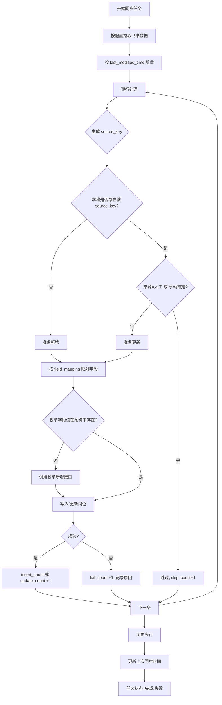

# M2.3 飞书同步逻辑说明

本文档对「字段映射配置」用途、默认配置、唯一同步标识符、增量更新及枚举自动新增等做统一说明，供 M2.1/M2.2 与开发实现对齐。

---

## 1. 字段映射配置（field_mapping）是做什么的？

- **用途**：飞书多维表格的列名（或列 ID）与系统库表字段名是一一映射关系。同步时，系统读取飞书每一行的列，根据 field_mapping 把「飞书列 A」的值写入「系统字段 company_name」、「飞书列 B」写入「系统字段 job_title」等。
- **格式**：JSON 对象，键为飞书侧列名（或列 ID），值为系统 ER 中定义的字段名。系统字段名必须与校招岗位/事业编岗位 ER 一致，否则写入失败或忽略。
- **是否可随便定义**：不可以。键必须与飞书表格中实际列名一致（或使用飞书列 ID）；值必须是系统已支持的字段名。系统提供**默认模板**，管理员在默认模板上按实际飞书表结构调整键名即可。

---

## 2. 默认字段映射配置

### 2.1 校招（data_type = campus）默认模板

以下为示例，键需与飞书表列名一致，值必须与校招岗位 ER 字段一致。

```json
{
  "企业名称": "company_name",
  "招聘岗位": "job_title",
  "工作城市": "city",
  "企业类型": "company_type",
  "招聘类型": "recruit_type",
  "所属行业": "industry",
  "网申开始日期": "apply_start_date",
  "网申截止日期": "apply_end_date",
  "毕业生要求": "graduate_requirement",
  "信息来源": "source_info",
  "投递链接": "apply_url",
  "原文链接": "source_url"
}
```

### 2.2 事业编（data_type = civil）默认模板

```json
{
  "公告标题": "title",
  "省份": "province",
  "区域": "district",
  "类型": "unit_type",
  "报名开始日期": "apply_start_date",
  "报名截止日期": "apply_end_date",
  "招聘人数": "recruit_count",
  "职位数量": "position_count",
  "公告详情": "detail_content",
  "报考学历要求": "education_requirement",
  "报考年龄要求": "age_requirement",
  "具体岗位": "position_names",
  "原文链接": "source_url"
}
```

- 系统初始化两条配置时，应写入上述默认 JSON；管理员可在编辑页修改键（飞书列名）或删减/增加映射项（值仍须为 ER 字段名）。

---

## 3. 唯一同步标识符（增量更新依据）

- **校招岗位**：以「企业名称 + 招聘岗位」唯一确定一条记录。  
  - `source_key = 企业名称 + "|" + 招聘岗位`（或不可逆 hash，同一组合得到同一 source_key）。  
  - 飞书同一条「企业名称+招聘岗位」多次同步只做更新，不重复插入。
- **事业编岗位**：以「公告标题」唯一确定一条记录。  
  - `source_key = 公告标题`（或 hash(公告标题)）。  
  - 飞书同一条公告标题多次同步只做更新。

---

## 4. 同步逻辑流程（概要）



---

## 5. 枚举未匹配时自动新增

- 同步写入时，若某字段为「枚举类型」（如企业类型、招聘类型、所属行业、事业编类型等），飞书中的取值在系统枚举表中不存在时：
  - **应调用该枚举对应的「新增枚举项」接口**（如字典/枚举管理提供的接口），自动新增该枚举值；
  - 再将该值写入岗位记录。
- 若枚举新增接口失败，则该条岗位写入失败，计 fail_count，并记录原因（如「枚举新增失败：xxx」）。

---

## 6. 与 M2.1 / M2.2 的对应关系

| 内容 | M2.1 | M2.2 |
|------|------|------|
| 字段映射配置 | 编辑表单必填，可选用默认模板 | 执行时读取配置，按映射写入 |
| 默认配置 | 初始化时写入校招/事业编默认 JSON | — |
| 唯一标识 | — | 校招=企业名称+招聘岗位；事业编=公告标题 |
| 枚举自动新增 | — | 同步时调用枚举新增接口 |
