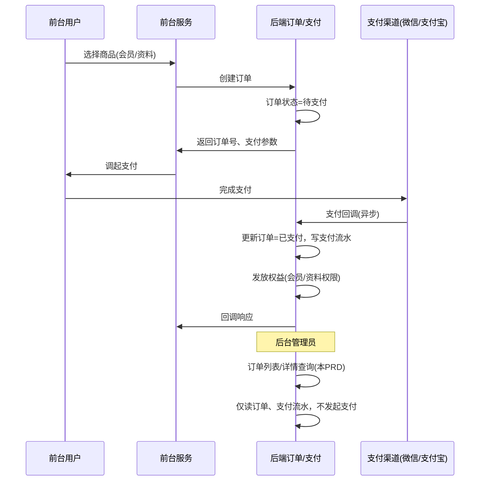

# M6.1 订单管理

| 项目 | 说明 |
|------|------|
| **功能名称** | 订单列表与订单详情 |
| **对应 FeatureList** | 9.6.1 订单查询 |
| **对应 ER 实体** | 订单、支付流水 |
| **对应时序图** | 时序图05_会员购买；订单与支付体系见本 PRD 第 5 节及下方 mermaid 图 |

---

## 1. 需求背景与目标

- 订单与**支付体系打通**：前台用户发起会员/资料购买 → 创建订单 → 调起支付（微信/支付宝）→ 支付回调 → 更新订单状态并发放权益。后台订单管理不发起支付，仅**查询与展示**订单及支付流水，便于对账与客诉。
- 目标：列表字段清晰，详情含订单基础信息与支付回调状态；与前台支付流程、支付渠道（微信/支付宝）在设计上统一考虑，见第 5 节「订单与支付体系关系」及时序图。

---

## 2. 角色与入口

- **角色**：管理员。
- **入口**：左侧菜单「会员与订单」→ Tab「订单列表」；右侧主内容区为筛选 + 表格；行内「查看详情」打开抽屉。
- **登录态**：需已登录后台。

---

## 3. 页面结构与交互

- **布局**：左侧菜单 + 右侧主内容区。
- **订单列表**：筛选（时间范围、用户ID/昵称、商品类型：会员/资料、订单状态、支付渠道）、表格（订单号、用户、商品名称、商品类型、原价、实付、支付渠道、状态、创建时间、支付时间、操作：详情）、分页。
- **订单详情抽屉**：订单号、用户ID/昵称（可跳转用户列表）、商品信息、原价、实付、优惠券抵扣、支付渠道、订单状态、创建/支付时间；**支付流水**（第三方交易号、金额、回调状态、支付时间）；若有退款则展示退款状态与时间。

---

## 4. 字段规格表（列表与详情）

| 字段显示名 | 字段键名 | 区域 | 类型 | 说明 |
|------------|----------|------|------|------|
| 订单号 | order_no | 列表/详情 | string | UK |
| 用户 | user_id / nickname | 列表/详情 | — | 可展示昵称，详情可跳转用户 |
| 商品名称 | product_name | 列表/详情 | string | 如「校招会员-1年」「XX面试资料」 |
| 商品类型 | product_type | 列表/筛选 | enum | membership / doc |
| 原价 | original_amount | 列表/详情 | decimal | 元 |
| 实付金额 | pay_amount | 列表/详情 | decimal | 元 |
| 支付渠道 | pay_channel | 列表/筛选 | enum | wechat / alipay |
| 订单状态 | order_status | 列表/筛选 | enum | 待支付/已支付/已退款/已关闭 |
| 创建时间 | created_at | 列表 | datetime | — |
| 支付时间 | paid_at | 列表/详情 | datetime | 未支付为空 |
| 第三方交易号 | transaction_id | 详情-流水 | string | 微信/支付宝流水号 |
| 回调状态 | callback_status | 详情-流水 | string | 待回调/成功/失败 |

---

## 5. 订单与支付体系关系（与前台支付一起设计）

- **建议**：订单列表、支付流水、退款与前台「创建订单 → 调起支付 → 回调 → 发权益」应在同一套产品与技术方案下设计，避免后台只看订单而支付状态来源不清。
- **前台流程**：用户选择商品（会员/资料）→ 前台请求创建订单 → 后端生成订单（待支付）、返回支付参数 → 用户调起微信/支付宝 → 支付成功后渠道回调后端 → 后端更新订单为已支付、写支付流水、发放会员或资料权限。
- **后台职责**：查询订单列表、订单详情、支付流水；不在此发起支付或创建订单；退款若在本期实现，可在本模块或 M6.2 增加「标记退款」等操作及规则。

### 5.1 订单与支付时序图（后台视角：仅查询；创建与回调为前台/支付侧）

---

## 6. 业务逻辑与状态流转

- **R-01**：订单状态机：待支付 → 已支付（支付回调成功）；已支付 → 已退款（退款成功）；待支付 → 已关闭（超时或取消）。
- **R-02**：列表仅展示订单主表；详情中支付流水来自支付流水表，按订单ID关联；若有多条流水（如重试），均展示。
- **R-03**：退款处理见 M6.2 或单独售后 PRD；本 PRD 仅支持查询与展示，不包含「发起退款」操作（若 9.6.3 在本期实现，可在此增加「标记退款」按钮与规则）。

---

## 7. 异常与边界

- 支付中（订单状态=待支付但用户已扫码）：以订单状态为准；若需区分「支付中」可增加状态或展示支付流水为「处理中」。

---

## 8. 依赖与待定项

- **依赖**：订单表、支付流水表、用户表；支付回调与权益发放逻辑见时序图05；**与前台支付流程、支付渠道配置一起设计**。
- **待定**：是否支持导出订单列表；退款操作是否在本模块或 M6.2 统一描述。
