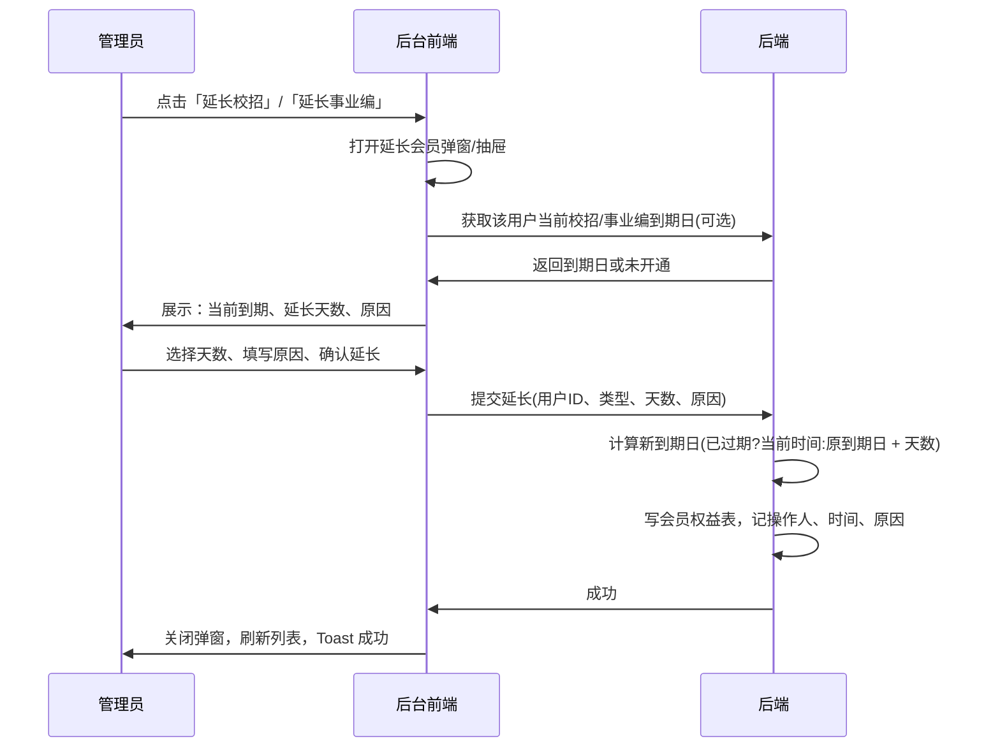

# M6.2 会员管理

| 项目 | 说明 |
|------|------|
| **功能名称** | 用户会员状态查看、已购资料、手动开通/延期 |
| **对应 FeatureList** | 9.6.2 会员管理 |
| **对应 ER 实体** | 会员权益、用户、用户资料权限（已购资料） |
| **对应时序图** | 见本 PRD 第 5 节 mermaid 图 |

---

## 1. 需求背景与目标

- 运营需按用户查看其校招/事业编会员到期时间、**已购资料列表**，并在客诉或活动场景下手动开通或延长会员。
- 目标：会员列表或用户详情中清晰展示各类型会员到期日与**已购资料**；提供「延长校招」「延长事业编」操作，有**明确的下级页面逻辑与产品逻辑**（弹窗/抽屉选择类型、天数、原因，确认后执行并反馈）。

---

## 2. 角色与入口

- **角色**：管理员。
- **入口**：左侧菜单「会员与订单」→ Tab「会员列表」；或从「用户列表」进入用户详情后查看其会员信息、已购资料并操作延长。
- **登录态**：需已登录后台。

---

## 3. 页面结构与交互

- **布局**：左侧菜单 + 右侧主内容区。
- **会员列表**（按用户聚合，每行一用户）：
  - 列：用户ID、昵称、校招会员到期、事业编会员到期、**已购资料数**（或「查看已购资料」链接）、操作（**延长校招**、**延长事业编**）。
- **已购资料**（必须补全）：
  - 入口：会员列表行内「查看已购资料」或用户详情内「已购资料」Tab/区块。
  - 展示：该用户已购买的面试资料列表，列：资料ID、资料标题、购买时间、订单号（可选）；只读，无删除/退还操作（或按后续售后规则）。
- **延长校招 / 延长事业编**（下级页面逻辑与产品逻辑）：
  - **触发**：点击「延长校招」或「延长事业编」→ 打开**延长会员**弹窗/抽屉（下级页面）。
  - **弹窗/抽屉内容**：当前用户、当前校招/事业编到期日（若未开通展示「未开通」）；**会员类型**（校招/事业编，若从「延长校招」进入则默认选中校招并可禁用切换）；**延长天数**（必填，1～3650，可快捷选 30/90/365）；**延长原因**（选填，≤200 字，便于审计）；按钮「取消」「确认延长」。
  - **交互**：确认延长 → 后端在原到期时间上累加（若已过期则从当前时间起算），写入会员权益表，记录操作人、操作时间、原因；前端关闭弹窗并刷新列表，可 Toast「延长成功」。
  - **规则**：同一用户可有多次延长记录；展示的「校招/事业编到期」取该类型下最大到期日；未开通时仍可点击「延长」为其开通（天数从当前时间起算）。

---

## 4. 字段规格表

| 字段显示名 | 字段键名 | 区域 | 类型 | 必填 | 说明 |
|------------|----------|------|------|------|------|
| 用户ID | user_id | 列表 | bigint | — | — |
| 昵称 | nickname | 列表 | string | — | 来自用户表 |
| 校招会员到期 | campus_expire_at | 列表/延长弹窗 | date | — | 该用户校招权益的最大到期日 |
| 事业编会员到期 | civil_expire_at | 列表/延长弹窗 | date | — | 该用户事业编权益的最大到期日 |
| **已购资料** | — | 列表/详情 | 只读列表 | — | 资料ID、标题、购买时间、订单号 |
| 会员类型 | member_type | 延长弹窗 | enum | 是 | campus / civil |
| 延长天数 | extend_days | 延长弹窗 | int | 是 | 1～3650（约10年），正整数 |
| 延长原因 | extend_reason | 延长弹窗 | string | 否 | ≤200，可选填 |

---

## 5. 业务逻辑与延长流程时序图

- **R-01**：同一用户可有多次会员购买/延长记录；展示时取「该类型下最大到期时间」作为当前到期日；若已过期则展示「已过期」并允许再次延长。
- **R-02**：延长时，若当前已过期则以「当前时间」为起点累加天数；若未过期则以「当前到期时间」为起点累加。
- **R-03**：手动延长不创建订单，仅写会员权益表（或延长期记录表），并记录操作人 ID、操作时间、原因，便于审计。
- **R-04**：已购资料来自「用户资料权限」或订单明细（商品类型=资料且订单状态=已支付），只读展示，不在此做退还（若需则见售后 PRD）。

### 5.1 延长会员流程（管理员侧）

---

## 6. 异常与边界

- 用户无任何会员：校招/事业编到期列展示「—」或「未开通」，仍可操作「延长」为其开通。
- 已购资料为空：展示「暂无已购资料」。

---

## 7. 依赖与待定项

- **依赖**：会员权益表、用户表、用户资料权限表（或订单明细）；M6.1 订单与支付发放资料权限的逻辑。
- **待定**：是否支持「减期」或「作废」某条权益（V1 可不做）；已购资料是否支持「退还」由售后 PRD 约定。
