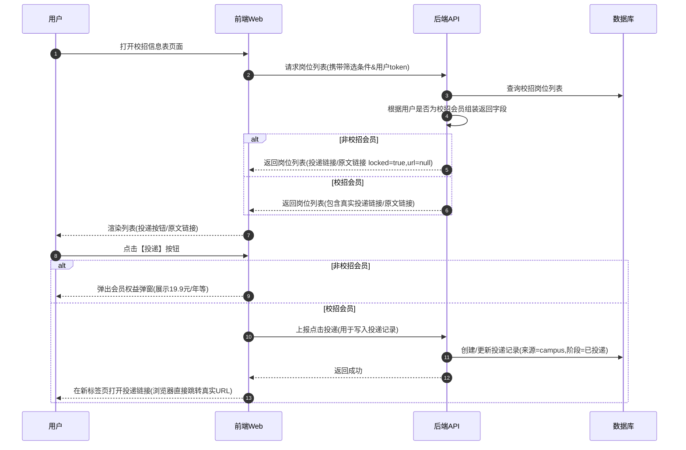
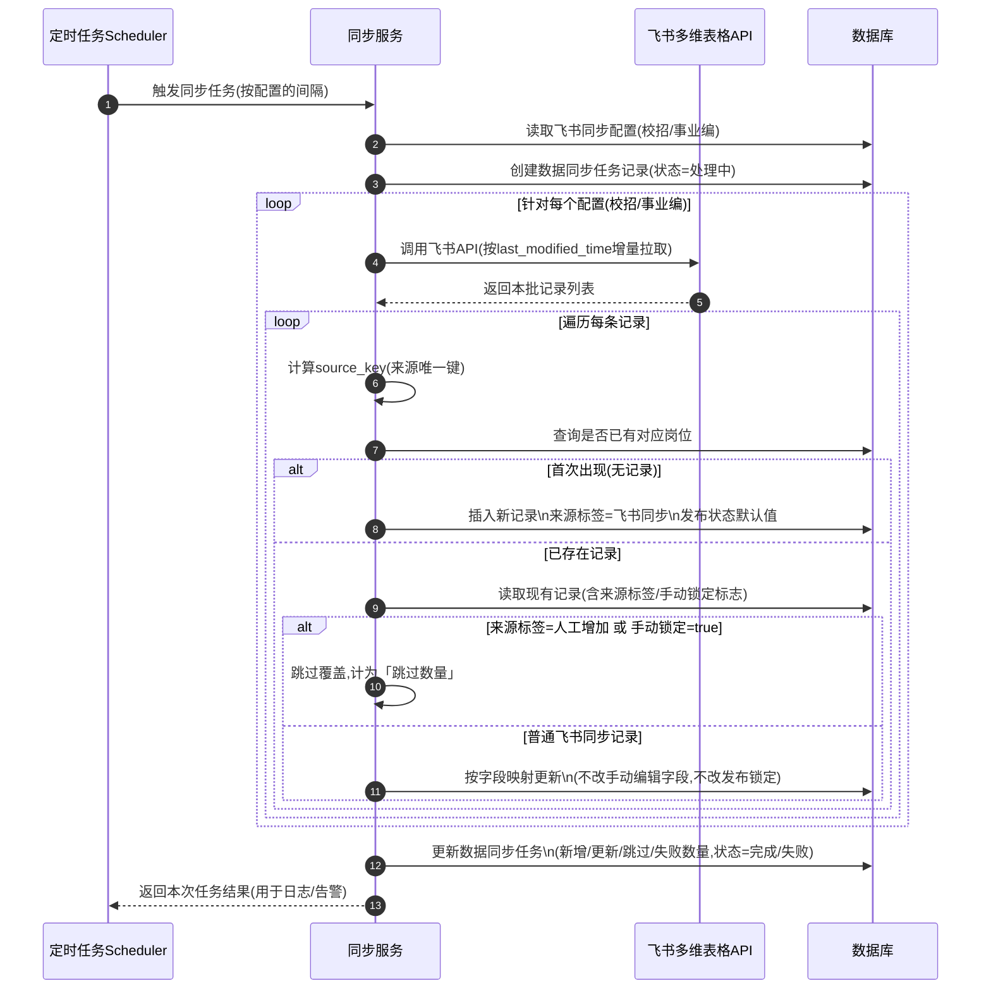

# Offer信息站（OfferAI）产品蓝图与场景说明（V1）

> 本文基于现有 PRD、Feature List、ER 图与时序图，对 Offer信息站 Web 产品进行整体蓝图梳理，作为后续 PRD 与技术设计的统一上游视图。

---

## 1. 版本信息与范围

- **产品名称**：Offer信息站（OfferAI）
- **版本范围**：V1 Web 版本（前台 + 后台管理）
- **涉及端**：
  - C 端 Web：落地页、校招信息表、事业编/国企信息表、面试资料、个人中心、投递看板
  - 后台管理：内容管理、飞书同步、会员与订单、用户管理
- **主要依赖**：
  - 飞书多维表格（岗位源数据）
  - 支付渠道：微信支付 / 支付宝（开发期以 Mock/沙箱为主）
  - 数据存储：PostgreSQL、Redis、阿里云 OSS

---

## 2. 需求背景与业务目标

### 2.1 背景

求职者在校招与事业编/国企备考过程中，面临三类核心问题：

1. **信息获取困难**：公告分散在各官网/公众号，更新快，投递入口不统一；
2. **过程管理混乱**：多平台投递记录难以统一管理，容易重复投、漏投；
3. **面试准备成本高**：面试资料零散，缺乏可直接购买的结构化内容。

已有渠道（如小红书）可提供内容曝光，但缺乏可沉淀的 Web 产品与付费闭环。

### 2.2 业务目标（V1）

- **商业闭环**：跑通「浏览信息 → 触发付费墙 → 开通会员/购买资料 → 解锁权益 → 持续使用」的完整闭环；
- **使用留存**：通过收藏、分组、进度看板等能力，让会员形成持续使用习惯；
- **增长飞轮**：配合邀请返利、分享卡片、UTM 渠道追踪等机制，支持从内容渠道到产品的转化与拉新；
- **可运营后台**：提供岗位数据导入/更新、资料上架、订单与会员管理等后台能力，支撑持续运营。

---

## 3. 用户角色与权限视角

### 3.1 主要用户角色

| 角色 | 描述 | 典型诉求 |
| --- | --- | --- |
| **访客** | 未登录用户，从小红书等渠道跳转而来 | 快速浏览岗位信息，感知产品价值，判断是否值得注册/付费 |
| **注册用户** | 已登录但未开通会员的用户 | 收藏岗位、简单管理，但尚未付费；希望先体验后决策 |
| **会员用户** | 开通校招/事业编会员的用户 | 解锁完整信息（投递/原文链接）、高效管理投递进度与资料 |
| **资料购买用户** | 购买单份/多份面试资料的用户 | 快速找到目标企业/岗位的高质量资料，并安全下载/查看 |
| **管理员** | 后台运营/管理人员 | 高效维护岗位与资料数据、查看订单与会员情况、处理异常 |

### 3.2 权限与视图要点

- 访客仅能浏览公开字段，所有带「投递/原文链接」「完整资料」的内容均通过**付费墙**与**登录态**控制；
- 注册用户可见更多字段与收藏等功能，但仍无法访问核心解锁项；
- 会员用户在前台页面中获得完整功能（投递链接、原文链接、工作台、简历管理等）；
- 管理员通过后台独立登录入口访问管理界面，具备飞书同步、内容审核、订单与用户管理能力。

---

## 4. 关键场景列表（SCN）

> 场景 ID 与 Feature List、PRD Header 中的「对应场景」字段保持一致，时序图以 `时序图0X_*.mmd` 对应。

### SCN-01｜从内容渠道到会员转化

- **名称**：小红书引流 → 浏览校招信息表 → 触发付费墙 → 开通会员  
- **触发条件**：用户从小红书帖子点击链接进入落地页或校招信息表页面。  
- **主流程概览**：
  1. 访客从内容平台点击链接，进入落地页/校招信息表；
  2. 浏览岗位列表，发现感兴趣岗位；
  3. 点击投递链接/来源时触发付费墙弹窗，展示会员权益对比与套餐；
  4. 用户完成登录（微信扫码）并选择套餐，下单并支付成功；
  5. 页面刷新后解锁投递入口，可继续浏览/投递。
- **成功结果**：完成会员支付，用户在当前会话中解锁投递链接，并在后续访问中保持登录与会员态。  
- **相关时序图**：`时序图01_微信扫码登录.mmd`、`时序图02_校招信息表浏览与解锁.mmd`

### SCN-02｜批量投递后的进度管理与回访

- **名称**：批量投递 → 使用投递看板与过滤能力管理进度  
- **触发条件**：用户已完成一定数量的岗位投递，期望集中管理进度。  
- **主流程概览**：
  1. 会员用户在校招信息表中勾选/记录已投递岗位；
  2. 在工作台/投递看板中，为每条记录标注阶段（已投递/笔试/面试等）与备注；
  3. 在校招信息表中，可按投递状态过滤、隐藏已投递岗位；
  4. 定期回访信息表，查看新增岗位并继续投递。
- **成功结果**：用户能清晰掌握各岗位进度，减少重复投递与遗漏。  
- **相关时序图**：`时序图02_校招信息表浏览与解锁.mmd`

### SCN-03｜事业编/国企岗位浏览与公告详情解锁

- **名称**：浏览事业编信息表 → 解锁公告详情与报名入口  
- **触发条件**：用户对事业编/国企岗位感兴趣，进入事业编信息表页面。  
- **主流程概览**：
  1. 用户在事业编信息表中按照地区、岗位类别等筛选；
  2. 浏览岗位列表与关键字段；
  3. 点击原文链接/公告详情时，若非会员则触发付费墙或引导开通事业编会员；
  4. 开通会员后，可在新标签页打开公告原文与报名入口。
- **成功结果**：用户成功获取目标岗位的公告详情与报名通道。  
- **相关时序图**：`时序图03_事业编信息表浏览与公告详情.mmd`

### SCN-04｜面试资料预览与购买

- **名称**：按企业/岗位筛选面试资料 → 预览 → 购买解锁全文  
- **触发条件**：用户希望针对特定企业/岗位进行面试准备。  
- **主流程概览**：
  1. 用户在面试资料页面按企业、岗位等级等搜索/筛选；
  2. 点击某份资料进入详情页，默认展示前若干页预览；
  3. 用户确认价值后点击购买，完成支付；
  4. 支付成功后，资料在账户下永久或限期解锁，可在线阅读/带水印下载。
- **成功结果**：用户成功购买并访问面试资料，提升备考效率。  
- **相关时序图**：`时序图04_面试资料预览与购买.mmd`

### SCN-05｜会员套餐购买与权益发放

- **名称**：选择套餐 → 支付 → 自动发放会员权益  
- **触发条件**：用户在任一付费入口（付费墙、套餐页、个人中心）点击「开通会员」。  
- **主流程概览**：
  1. 用户在套餐页选择校招/事业编/组合套餐；
  2. 创建订单并调起支付（微信/支付宝）；
  3. 支付回调成功后，系统写入/更新 `member_rights` 表；
  4. 前端刷新会员状态，解锁对应功能。
- **成功结果**：会员权益正确发放，前后端展示一致；若失败则有清晰的失败提示与重试路径。  
- **相关时序图**：`时序图05_会员购买.mmd`

### SCN-06｜飞书多维表格到系统数据库的同步

- **名称**：飞书多维表格定时/手动增量同步岗位数据  
- **触发条件**：定时任务到点或管理员在后台点击「手动同步」按钮。  
- **主流程概览**：
  1. 系统按上次同步时间从飞书多维表格读取增量数据；
  2. 将数据写入本地数据库的校招/事业编岗位表，区分来源（飞书同步 vs 人工增加）；
  3. 对已下架/删除的数据做软删除或状态更新；
  4. 记录同步日志与错误明细，便于排查。
- **成功结果**：前台信息表中的数据与飞书保持近实时一致，且不会误覆盖本地人工录入数据。  
- **相关时序图**：`时序图06_飞书多维表格定时增量同步到系统数据库.mmd`

---

## 5. 能力地图草图（领域 → 模块 → 能力）

> 能力 ID 可与 Feature List 编号对应，用于在 PRD 与技术文档中进行追溯。

### 5.1 领域：账户与通用（DM-ACCT）

- **模块 A1｜账号与登录**
  - ACCT-LOGIN-WX：微信扫码登录与自动注册
  - ACCT-SESSION：登录态保持与过期处理
- **模块 A2｜个人中心**
  - ACCT-PROFILE：基本信息展示（头像、昵称）
  - ACCT-RIGHTS：我的权益（会员类型与到期时间、已购资料）
  - ACCT-ORDERS：订单列表（会员订单 + 资料订单）
- **模块 A3｜导航与布局**
  - ACCT-NAV-MAIN：顶部导航与入口
  - ACCT-NAV-BADGE：会员状态角标与到期提醒

### 5.2 领域：前台信息表（DM-FRONTLIST）

- **模块 F1｜校招信息表**
  - F1-LIST：岗位列表与字段展示
  - F1-FILTER：筛选与排序（城市、行业、网申时间等）
  - F1-APPLY-LINK：投递链接解锁与点击统计
  - F1-ORIGIN-LINK：公告原文链接解锁
  - F1-FAV：岗位收藏与分组
- **模块 F2｜事业编/国企信息表**
  - F2-LIST：事业编岗位列表
  - F2-FILTER：按地区/岗位类别筛选
  - F2-ORIGIN-LINK：公告详情与报名入口解锁

### 5.3 领域：面试资料（DM-DOCS）

- **模块 D1｜资料列表与搜索**
  - D1-LIST：按企业/岗位/标签筛选资料
  - D1-SEARCH：关键词搜索
- **模块 D2｜预览与购买**
  - D2-PREVIEW：限制页数的预览（含水印/防扩散策略预留）
  - D2-PURCHASE：单品购买与支付流程
  - D2-ACCESS：购买后的阅读与下载权限控制

### 5.4 领域：投递管理与工作台（DM-WORKSPACE）

- **模块 W1｜投递记录管理**
  - W1-RECORD：记录岗位与投递时间
  - W1-STAGE：进度阶段标记（已投递/笔试/面试/已录/淘汰）
  - W1-REMARK：备注与补充信息
- **模块 W2｜看板视图与过滤**
  - W2-KANBAN：按阶段分列的看板展示
  - W2-FILTER：按进度、分组、收藏状态过滤

### 5.5 领域：会员与支付（DM-MEMBER）

- **模块 M1｜套餐与订单**
  - M1-SKU：套餐定义（校招/事业编/组合）
  - M1-ORDER：订单创建与状态机
- **模块 M2｜支付与回调**
  - M2-PAYMENT：调起支付与前端状态展示
  - M2-CALLBACK：支付回调验签与幂等处理
- **模块 M3｜权益发放**
  - M3-RIGHTS：member_rights 写入/更新
  - M3-EXPIRE：到期提醒与后续策略预留

### 5.6 领域：内容与同步后台（DM-ADMIN）

- **模块 B1｜内容管理**
  - B1-CAMPUS：校招岗位管理（增删改查、上下架）
  - B1-CIVIL：事业编岗位管理
  - B1-DOCS：面试资料管理
- **模块 B2｜飞书同步**
  - B2-TASK：同步任务调度与监控
  - B2-LOG：同步日志与错误处理
- **模块 B3｜用户与运营**
  - B3-USERS：用户管理（封禁、备注等）
  - B3-FEEDBACK：用户反馈处理

---

## 6. 非目标与本次不做范围

为避免范围扩散，本次 V1 不覆盖或仅做占位的内容包括：

- 雇主侧（企业 HR）管理后台与岗位投放入口；
- 原生移动 App 与小程序，仅支持通过 H5/Webview 访问；
- 复杂的推荐算法与个性化排序（暂按简单规则/手动配置处理）；
- 精细化营销自动化（多渠道触达、A/B 测试平台等），仅保留基本 UTM 追踪与邀请返利逻辑占位；
- 多租户与多语言支持。

---

## 7. UML 图源码（内联）

为方便在 PRD、技术设计与实现中直接查看/复制，这里**内联存放 ER 图与关键时序图的 Mermaid 源码**，后续可不再依赖单独的 `.mmd`/`.md` 文件。

### 7.1 数据 ER 图源码

```mermaid
erDiagram

    %% ─────────────────────────────────────────
    %% 用户体系
    %% ─────────────────────────────────────────

    用户 {
        bigint   用户ID      PK
        string   微信openid  UK "微信唯一标识"
        string   昵称
        string   头像URL
        string   角色        "user / admin"
        string   utm来源     "注册时记录，如 xiaohongshu"
        string   utm活动     "如 春招攻略帖"
        string   utm内容     "帖子ID等"
        datetime 注册时间
    }

    %% ─────────────────────────────────────────
    %% 会员 & 支付
    %% ─────────────────────────────────────────

    订单 {
        bigint   订单ID       PK
        string   订单号       UK
        bigint   用户ID       FK
        string   商品类型     "membership / doc"
        bigint   商品ID       "会员SKU-ID 或 资料ID"
        bigint   用户优惠券ID FK "可为空"
        decimal  原价
        decimal  实付金额
        string   支付渠道     "wechat / alipay"
        string   订单状态     "待支付/已支付/已退款/已关闭"
        datetime 创建时间
        datetime 支付时间
    }

    支付流水 {
        bigint   浟水ID        PK
        bigint   订单ID        FK
        string   第三方交易号  UK "微信/支付宝流水号"
        string   支付渠道
        decimal  金额
        string   回调状态      "待回调/成功/失败"
        datetime 支付时间
    }

    会员权益 {
        bigint   权益ID   PK
        bigint   用户ID   FK
        bigint   订单ID   FK
        string   会员类型 "campus（校招）/ civil（事业编）"
        datetime 开始时间
        datetime 到期时间
        string   状态     "有效/已过期"
    }

    优惠券模板 {
        bigint   模板ID       PK
        string   优惠码       UK
        string   类型         "固定减 / 折扣"
        decimal  面值
        decimal  折扣率       "折扣类型时使用，如0.75=75折"
        string   适用商品类型 "membership / doc / all"
        int      使用上限     "0表示不限"
        int      已使用次数
        datetime 有效期至
        datetime 创建时间
    }

    用户优惠券 {
        bigint   用户券ID   PK
        bigint   用户ID     FK
        bigint   模板ID     FK
        bigint   使用订单ID FK "使用时关联的订单，可为空"
        string   状态       "未使用 / 已使用 / 已过期"
        string   获取来源   "活动发放 / 手动发放"
        datetime 获取时间
        datetime 使用时间
    }

    %% ─────────────────────────────────────────
    %% 内容数据：校招岗位
    %% ─────────────────────────────────────────

    校招岗位 {
        bigint   岗位ID       PK
        string   来源唯一键   UK "source_key，防重复同步"
        string   来源标签     "飞书同步 / 人工增加"
        string   企业名称
        string   企业类型     "国企/民企/合资/外企/事业单位/公益性"
        string   招聘类型     "动态标签：26届春招/26届秋招/暑期实习/日常实习"
        string   工作城市
        string   招聘岗位
        string   所属行业     "金融业/IT互联网/房地产建筑/耐用消费品/..."
        string   信息来源     "文本，如企业公众号名称"
        date     网申开始日期
        date     网申截止日期
        string   毕业生要求   "如 国内:博士及以上/26届；留学生:博士及以上/26届"
        string   投递链接     "加密存储，仅校招会员可获取"
        string   原文链接     "加密存储，仅校招会员可获取"
        string   发布状态     "PUBLISHED / UNPUBLISHED"
        string   生命周期     "ACTIVE / EXPIRED / DELETED"
        boolean  手动锁定     "true时飞书同步不得覆盖或恢复发布"
        datetime 创建时间
        datetime 更新时间
    }

    %% ─────────────────────────────────────────
    %% 内容数据：事业编/国企岗位
    %% ─────────────────────────────────────────

    事业编岗位 {
        bigint   岗位ID       PK
        string   来源唯一键   UK "source_key，防重复同步"
        string   来源标签     "飞书同步 / 人工增加"
        string   公告标题
        string   机构名称
        string   地区
        string   报名入口URL
        string   公告来源URL
        string   发布状态     "PUBLISHED / UNPUBLISHED"
        string   生命周期     "ACTIVE / EXPIRED / DELETED"
        boolean  手动锁定
        datetime 创建时间
        datetime 更新时间
    }

    %% ─────────────────────────────────────────
    %% 用户行为：投递 & 收藏 & 分组
    %% ─────────────────────────────────────────

    投递记录 {
        bigint   记录ID       PK
        bigint   用户ID       FK
        string   目标类型     "campus / civil"
        bigint   目标ID       "对应 校招岗位.岗位ID / 事业编岗位.岗位ID"
        string   当前阶段     "未投/已投/笔试/一面/二面/OC/拒"
        datetime 首次投递时间
        datetime 最近更新时间
        string   备注
        bigint   关联简历ID   FK "可为空"
    }

    简历 {
        bigint   简历ID      PK
        bigint   用户ID      FK
        string   文件名
        string   文件Key     "OSS key"
        string   标签        "如 春招通用版 / 投行专用版"
        datetime 上传时间
    }

    分组 {
        bigint   分组ID      PK
        bigint   用户ID      FK
        string   名称
        datetime 创建时间
    }

    分组项 {
        bigint   分组项ID    PK
        bigint   分组ID      FK
        string   目标类型    "campus / civil"
        bigint   目标ID
        datetime 加入时间
    }

    收藏 {
        bigint   收藏ID      PK
        bigint   用户ID      FK
        string   目标类型    "campus / civil / doc"
        bigint   目标ID
        datetime 收藏时间
    }

    %% ─────────────────────────────────────────
    %% 内容数据：面试资料
    %% ─────────────────────────────────────────

    面试资料 {
        bigint   资料ID      PK
        string   标题
        string   企业名称
        string   岗位名称
        string   标签        "如 秋招/暑期实习/算法/产品/..."
        string   文件Key     "OSS key"
        int      总页数
        int      预览页数    "默认3页"
        string   发布状态    "PUBLISHED / UNPUBLISHED"
        datetime 创建时间
        datetime 更新时间
    }

    用户资料访问 {
        bigint   访问ID      PK
        bigint   用户ID      FK
        bigint   资料ID      FK
        bigint   订单ID      FK "购买来源，可为空（如赠送）"
        string   访问类型    "预览 / 已购访问 / 下载"
        datetime 访问时间
    }

    %% ─────────────────────────────────────────
    %% 字典 & 配置 & 同步
    %% ─────────────────────────────────────────

    字典字段 {
        bigint   字段ID      PK
        string   字段编码    "如 industry / city / job_type"
        string   字段名称
        string   说明
        string   状态        "enable / disable"
    }

    字典项 {
        bigint   字典项ID    PK
        bigint   字段ID      FK
        string   选项编码    "如 finance / it / shanghai"
        string   选项名称
        int      排序
        string   状态
    }

    飞书数据源 {
        bigint   数据源ID    PK
        string   类型        "campus / civil"
        string   base_id
        string   table_id
        string   描述
        string   状态
        datetime 创建时间
    }

    同步任务 {
        bigint   任务ID      PK
        bigint   数据源ID    FK
        datetime 开始时间
        datetime 结束时间
        string   状态        "running / success / failed"
        int      新增数
        int      更新数
        int      失败数
    }

    %% ─────────────────────────────────────────
    %% 关系定义
    %% ─────────────────────────────────────────

    用户       ||--o{ 订单             : 下单
    订单       ||--o{ 支付流水         : 有
    用户       ||--o{ 会员权益         : 拥有
    订单       ||--o{ 会员权益         : 产生
    用户       ||--o{ 用户优惠券       : 拥有
    优惠券模板 ||--o{ 用户优惠券       : 发放

    用户       ||--o{ 投递记录         : 有
    用户       ||--o{ 简历             : 上传
    简历       ||--o{ 投递记录         : 被引用

    用户       ||--o{ 分组             : 创建
    分组       ||--o{ 分组项           : 包含
    用户       ||--o{ 收藏             : 进行

    校招岗位   ||--o{ 投递记录         : 被投递
    事业编岗位 ||--o{ 投递记录         : 被投递

    面试资料   ||--o{ 用户资料访问     : 被访问

    字典字段   ||--o{ 字典项           : 包含

    飞书数据源 ||--o{ 同步任务         : 触发
```

### 7.2 时序图源码（关键场景）

#### 7.2.1 SCN-02｜校招信息表浏览与解锁（含投递记录写入）

#### 7.2.2 SCN-06｜飞书多维表格定时增量同步到系统数据库

后续若增加新场景或模块，请：

1. 在本蓝图中补充新的场景条目与能力节点；
2. 在 Feature List 中增加对应编号；
3. 在相关 PRD Header 中填入「对应场景 ID」「对应 ER 实体」「对应时序图」。

